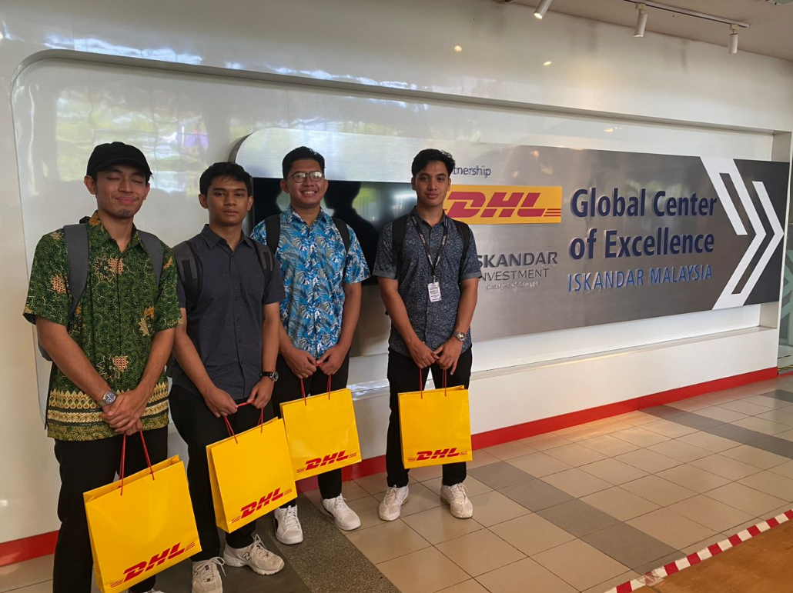

# Food-Nexus-Datathon
I am thrilled to share my exciting journey as a finalist in the Food Nexus Datathon Challenge, taken place at the prestigious DHL Global Center of Excellence in Medini 6, Iskandar Puteri, Johor Bahru, Johor. This remarkable competition, brought to life through a collaborative effort between the Universiti Teknologi Malaysia (UTM) and the logistical powerhouse DHL, has brought together a diverse array of talents from both local and international teams. As one of the ten finalists, my teamate and I learn a lot of new knowledge and experience, where innovation, data, and food technology converge in the quest to shape the future of the food industry.

Learn more about this datathon at <a href="https://foodnexuschallenge.com/">https://foodnexuschallenge.com</a>

